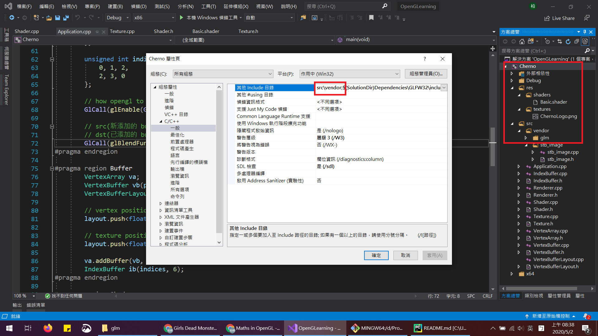

# OpenGLearning
紀錄 OpenGL 學習過程

## [OpenGL Mathematics (GLM)](https://github.com/g-truc/glm)
OpenGL 相關的數學函式庫，以下安裝及使用參考 
[The Cherno](https://www.youtube.com/watch?v=VuYnjsDOx60&list=PLlrATfBNZ98foTJPJ_Ev03o2oq3-GGOS2&index=19) 
的教學影片。

1. 首先於標題連結的 github 倉庫當中的 releases 下載最新版的壓縮檔。
2. 壓縮檔解壓縮後，將 glm/glm 複製到自己的專案當中，此資料夾為 header 檔。
3. 於 VS 當中對專案名稱按右鍵 > 屬性 > (組態：所有組態) > C/C++ > 一般 > 
4. 在 "其他 include 目錄" 當中加入前述資料夾所在的位置(如同下圖中的紅框處)，並以分號(;)間隔 。
5. 後續 include 時，可以直接 include 該資料夾的內容，而不需再將其上層路徑也寫入 include 當中。

* 將 glm/glm 複製到專案當中後，按方案總管當中的重新整理後，才會看到新增的資料夾。
* 剛加入的檔案可能會看到紅色符號，此時須對 glm/glm 按右鍵 > 加入至專案。
* 與教學影片不同的是，dummy.cpp 似乎已經從該資料夾中移除，不需要再像影片中一樣將它排除在專案之外。

## [ImGui](https://github.com/ocornut/imgui)
OpenGL 使用者介面(UI)的函式庫，以下安裝及使用參考 
[The Cherno](https://www.youtube.com/watch?v=nVaQuNXueFw&list=PLlrATfBNZ98foTJPJ_Ev03o2oq3-GGOS2&index=22) 
的教學影片。

1. 首先於標題連結的 github 倉庫當中的 releases 下載最新版的壓縮檔。
2. 壓縮檔解壓縮後，將資料夾 imgui-1.XX 最上層的 header 和 cpp 檔複製到自己的專案當中。
3. 為方便快速使用 UI ，借用其 imgui-1.XX/examples/example_glfw_opengl3 當中的 
imgui_impl_opengl3.h、imgui_impl_opengl3.cpp 和該專案的 main.cpp。
4. 對該資料夾按右鍵 > 加入至專案，但 main.cpp 要移除，因為其作用僅止於參考，不然會和自身專案的 
main() 產生衝突

* 教學影片中的版本較舊，新版的可根據使用者所用的函式庫，決定匯入 gl3w 還是 glew。
* 實際使用 imgui 的過程請看影片，而部分函式有做了些許改變，以下為 imgui-1.76 版本所做的相對應調整：
> 1. 初始化視窗改為使用 ImGui_ImplGlfw_InitForOpenGL 及 ImGui_ImplOpenGL3_Init。
> 2. 函式 ImGui_ImplGlfw_InitForOpenGL 的定義在 imgui_impl_glfw.h，因此需要自己在額外將 imgui_impl_glfw.h 和 
> imgui_impl_glfw.cpp 複製過來。
> 3. ImGui_ImplOpenGL3_Init(glsl_version) 中的 glsl_version 可參考原始的 main.cpp 當中，
> `const char* glsl_version = "#version 130";` 原始碼當中有針對不同平台去做調整。 