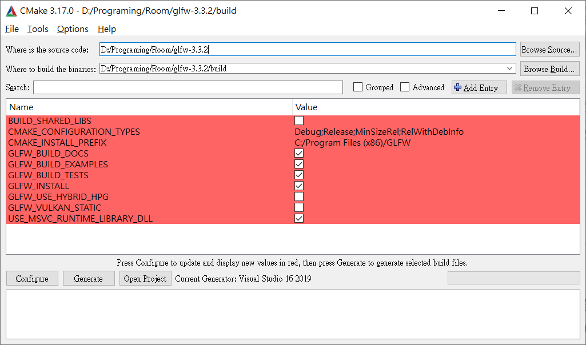

# OpenGLearning
紀錄 OpenGL 學習過程

## OpenGL 入門

OpenGL 本身並不是一個 API，它僅僅是一個由 [Khronos 組織](https://www.khronos.org/) 制定並維護的`規範(Specification)`。
OpenGL 規範嚴格規定了每個函數該如何執行，以及它們的輸出值。
實際的OpenGL庫的開發者通常是 GPU 的生產商。你購買的 GPU 所支持的 OpenGL 版本都為這個系列的 GPU 專門開發的。
當產生一個 bug 時通常可以通過升級顯卡驅動來解決。這些驅動會包括你的顯卡能支持的最新版本的 OpenGL，這也是為什麽總是建議你偶爾更新一下顯卡驅動。

OpenGL3.2 開始，規範文檔開始廢棄立即渲染模式（Immediate mode，也就是固定渲染管線）。
這個模式下繪制圖形容易使用和理解，但是大多數功能都被庫隱藏起來，開發者很少能控制 OpenGL 如何進行計算的自由。
因此在 OpenGL 的`核心模式(Core-profile)`下進行開發，開發者對繪圖細節有了更多的掌控，這個分支的規範完全移除了舊的特性。

### 擴展(Extension)

OpenGL 的一大特性就是對擴展的支持，當一個顯卡公司提出一個新特性或者渲染上的大優化，通常會以擴展的方式在驅動中實現。
如果一個程序在支持這個擴展的顯卡上運行，開發者可以使用這個擴展提供的一些更先進更有效的圖形功能。

通過這種方式，開發者不必等待一個新的 OpenGL 規範面世，就可以使用這些新的渲染特性了，只需要簡單地檢查一下顯卡是否支持此擴展。
通常，當一個擴展非常流行或者非常有用的時候，它將最終成為未來的 OpenGL 規範的一部分。

使用擴展的代碼大多看上去如下：

```cpp
if(GL_ARB_extension_name)
{
    // 使用硬體支援的全新的現代特性
}
else
{
    // 不支援此擴展: 用舊的方式去做
}
```

使用 OpenGL3.3 時，我們很少需要使用擴展來完成大多數功能，當需要的時候，本教程將提供適當的指示。

### 狀態機(State Machine)

OpenGL 自身是一個巨大的狀態機：一系列的變量描述 OpenGL 此刻應當如何運行。
OpenGL 的狀態通常被稱為 OpenGL 上下文(Context)。
我們通常使用如下途徑去更改 OpenGL 狀態：設置選項，操作緩沖。
最後，我們使用當前 OpenGL 上下文來渲染。

假設當我們想告訴 OpenGL 去畫線段而不是三角形的時候，我們通過改變一些上下文變量來改變 OpenGL 狀態，從而告訴 OpenGL 如何去繪圖。
一旦我們改變了 OpenGL 的狀態為繪制線段，下一個繪制命令就會畫出線段而不是三角形。

當使用 OpenGL 的時候，我們會遇到一些`狀態設置函數(State-changing Function)，這類函數將會改變上下文`。
以及`狀態使用函數(State-using Function)，這類函數會根據當前OpenGL的狀態執行一些操作`。
只要你記住OpenGL本質上是個大狀態機，就能更容易理解它的大部分特性。

_比較直觀的理解可以想成主詞被省略了。_
_延續上述對繪制線段的舉例，當目前的主詞(狀態)是"繪制線段"，下一句描述(使用)不需要特別提也知道主詞為"繪制線段"。_
_當主詞(狀態)改變了，需要特別將那個主詞說出來(狀態設置)。_

## GLFW

GLFW 是一個專門針對 OpenG L的 C 語言庫，它提供了一些渲染物體所需的最低限度的接口。
它允許用戶創建 OpenGL 上下文，定義窗口參數以及處理用戶輸入。

GLFW 可以從它官方網站的[下載頁](https://www.glfw.org/download.html)上獲取，為了完整性我們將從編譯源代碼開始。

下載源碼包之後，將其解壓並打開。我們只需要里面的這些內容：
* 編譯生成的庫
* include 文件夾

從源代碼編譯庫可以保證生成的庫是兼容你的操作系統和 CPU 的，而預編譯的二進制文件可能會出現兼容問題（甚至有時候沒提供支持你系統的文件）。
提供源代碼所產生的一個問題在於不是每個人都用相同的 IDE 開發程序，因而提供的工程/解決方案文件可能和一些人的 IDE 不兼容。
所以人們只能從 .c/.cpp 和 .h/.hpp 文件來自己建立工程/解決方案，這是一項枯燥的工作。
但因此也誕生了一個叫做 CMake 的工具。

### CMake

CMake 是一個工程文件生成工具。
用戶可以使用預定義好的 CMake 腳本，根據自己的選擇（像是Visual Studio, Code::Blocks, Eclipse）生成不同 IDE 的工程文件。
這允許我們從 GLFW 源碼里創建一個 Visual Studio 工程文件，之後進行編譯。

首先，我們需要從這里下載安裝 CMake。我選擇的是 Win32 安裝程序。
當 CMake 安裝成功後，可以選擇從命令行或者 GUI 啟動 CMake。
CMake 需要一個原始碼目錄和一個存放編譯結果的目標文件目錄。
源代碼目錄我們選擇 GLFW 的源代碼的根目錄，然後我們新建一個 build 文件夾，選中作為目標目錄。

下圖 2 個路徑分別為
* 原始碼目錄: 為包含 `CMakeLists.txt` 的那層資料夾。例：`D:/Programing/Room/glfw-3.3.2`。
* 存放編譯結果的目標文件目錄: 這個資料夾 CMake 會自行產生，無須手動創建。例：`D:/Programing/Room/glfw-3.3.2/build`。



在設置完源代碼目錄和目標目錄之後，點擊 Configure(設置)按鈕，讓 CMake 讀取設置和源代碼。
我們接下來需要選擇工程的生成器，我選用 Visual Studio。


CMake 會顯示可選的編譯選項用來配置最終生成的庫。
這里我們使用默認設置，並再次點擊 Configure(設置)按鈕保存設置。
保存之後，點擊 Generate(生成)按鈕，生成的工程文件會在你的 build 文件夾中。

### 編譯

在 build 資料夾里可以找到 GLFW.sln 文件，用 Visual Studio 打開。
因為 CMake 已經配置好了項目，所以我們直接點擊 Build Solution(生成解決方案)按鈕，然後編譯的庫 glfw3.lib（注意我們用的是第3版）就會出現在 src/Debug 資料夾內。

庫生成完畢之後，我們需要讓IDE知道庫和頭文件的位置。有兩種方法：

1. 找到 IDE 或者編譯器的 /lib 和 /include 文件夾，添加 GLFW 的 include 資料夾里的文件到 IDE 的 /include 文件夾里去。
用類似的方法，將 glfw3.lib 添加到 /lib 資料夾里去。
雖然這樣能工作，但這不是推薦的方式，因為這樣會讓你很難去管理庫和 include 文件，而且重新安裝 IDE 或編譯器可能會導致這些文件丟失。
2. 推薦的方式是建立一個新的目錄包含所有的第三方 lib 文件和 header 文件，並且在你的 IDE 或編譯器中指定這些文件夾。
我個人會使用一個單獨的文件夾，里面包含 Libs 和 Include 文件夾，在這里存放 OpenGL 工程用到的所有第三方庫和頭文件。
這樣我的所有第三方庫都在同一個位置（並且可以共享至多台電腦）。
然而這要求你每次新建一個工程時都需要告訴 IDE/編譯器 在哪能找到這些目錄。


完成上面步驟後，我們就可以使用 GLFW 創建我們的第一個 OpenGL 工程了！

### 鏈接

為了使我們的程式使用 GLFW，我們需要把GLFW庫鏈接(Link)進工程。
這可以通過在鏈接器的設置里指定我們要使用 glfw3.lib 來完成，但是由於我們將第三方庫放在另外的目錄中，我們的工程還不知道在哪尋找這個文件。
於是我們首先需要將我們放第三方庫的目錄添加進設置。

要添加這些目錄（需要 VS 搜索庫和 include 文件的地方），我們首先進入 Project Properties(工程屬性，在解決方案窗口里右鍵項目)，然後選擇 VC++ Directories(VC++ 目錄)選項卡（如下圖）。

在下面的兩欄添加目錄：


這里可以添加任意多個目錄，IDE 會從這些目錄里尋找頭文件。
所以只要你將 GLFW 的 Include 文件夾加進路徑中，你就可以使用 <GLFW/..> 來引用頭文件。庫文件夾也是一樣的。

最後需要在 Linker(鏈接器)選項卡里的 Input(輸入)選項卡里添加 glfw3.lib 這個文件：


如果你是 Windows 平台，opengl32.lib 已經包含在 Microsoft SDK 里了，它在 Visual Studio 安裝的時候就默認安裝了。
由於這篇教程用的是 VS IDE，並且是在 Windows 操作系統上，我們只需將 opengl32.lib 添加進連接器設置里就行了(如上圖所示)。

### GLAD

因為 OpenGL 只是一個標準/規範，具體的實現是由驅動開发商針對特定顯卡實現的。
OpenGL 驅動版本眾多，大多數函數的位置都無法在編譯時確定下來，需要在運行時查詢。
所以任務就落在了開發者身上，開發者需要在運行時獲取函數地址並將其保存在一個函數指針中供以後使用。

取得地址的方法因平台而異，在 Windows 上會是類似這樣：

```cpp
// 定義函數原型
typedef void (*GL_GENBUFFERS) (GLsizei, GLuint*);

// 找到正確的函數並賦值給函數指針
GL_GENBUFFERS glGenBuffers = (GL_GENBUFFERS)wglGetProcAddress("glGenBuffers");

// 現在函數可以被正常調用了
GLuint buffer;
glGenBuffers(1, &buffer);
```

可以看到代碼非常覆雜，而且很繁瑣，我們需要對每個可能使用的函數都要重覆這個過程。
幸運的是，有些庫能簡化此過程，其中 GLAD 是目前最新，也是最流行的庫。

**配置GLAD**

GLAD 是一個開源的庫，它能解決我們上面提到的那個繁瑣的問題。
GLAD 的配置與大多數的開源庫有些許的不同，GLAD 使用了一個[在線服務](https://glad.dav1d.de/)。
在這里我們能夠告訴 GLAD 需要定義的 OpenGL 版本，並且根據這個版本加載所有相關的 OpenGL 函數。

打開 GLAD 的在線服務，將語言(Language)設置為 C/C++，在 API 選項中，選擇3.3以上的OpenGL(gl)版本（我們的教程中將使用 3.3 版本，但更新的版本也能正常工作）。
之後將模式(Profile)設置為 Core，並且保證生成加載器(Generate a loader)的選項是選中的。
現在可以先（暫時）忽略拓展(Extensions)中的內容。
都選擇完之後，點擊生成(Generate)按鈕來生成庫文件。


GLAD 現在應該提供給你了一個 zip 壓縮文件，包含兩個頭文件目錄，和一個 glad.c 文件。


將兩個頭文件目錄（glad 和 KHR）複製到你的 Include 文件夾中（或者增加一個額外的項目指向這些目錄），


並添加 glad.c 文件到你的工程中。


經過前面的這些步驟之後，你就應該可以將以下的指令加到你的文件頂部了：

`#include <glad/glad.h> `

## 避免 include 出錯

### 顯示所有檔案


VS 有不同的專案檢視模式，其中"顯示所有檔案"的模式會將實際點入資料夾會看到的樣子呈現出來。

一開始建立 VS 專案，其檢視模式(後稱"專案模式")中會有"來源檔"、"資源檔"等資料夾，但資料夾實際上沒有，希望透過資料夾來分類整理腳本的效果也打折。

若非"顯示所有檔案"模式， include 套件或是讀取圖片用的路徑可能會找不到路徑。

如果是在"專案模式"又直接將檔案拉到 IDE 當中，實際的資料夾當中甚至找不到該檔案。
故建議一開始就使用"顯示所有檔案"的模式。

## [OpenGL Mathematics (GLM)](https://github.com/g-truc/glm)
OpenGL 相關的數學函式庫，以下安裝及使用參考 
[The Cherno](https://www.youtube.com/watch?v=VuYnjsDOx60&list=PLlrATfBNZ98foTJPJ_Ev03o2oq3-GGOS2&index=19) 
的教學影片。

1. 首先於標題連結的 github 倉庫當中的 releases 下載最新版的壓縮檔。
2. 壓縮檔解壓縮後，將 glm/glm 複製到自己的專案當中，此資料夾為 header 檔。
3. 於 VS 當中對專案名稱按右鍵 > 屬性 > (組態：所有組態) > C/C++ > 一般
4. 在 "其他 include 目錄" 當中加入前述資料夾所在的位置(如同下圖中的紅框處)，並以分號(;)間隔 。
5. 後續 include 時，可以直接 include 該資料夾的內容，而不需再將其上層路徑也寫入 include 當中。


* 將 glm/glm 複製到專案當中後，按方案總管當中的重新整理後，才會看到新增的資料夾。
* 剛加入的檔案可能會看到紅色符號，此時須對 glm/glm 按右鍵 > 加入至專案。
* 與教學影片不同的是，dummy.cpp 似乎已經從該資料夾中移除，不需要再像影片中一樣將它排除在專案之外。

## [ImGui](https://github.com/ocornut/imgui)
OpenGL 使用者介面(UI)的函式庫，以下安裝及使用參考 
[The Cherno](https://www.youtube.com/watch?v=nVaQuNXueFw&list=PLlrATfBNZ98foTJPJ_Ev03o2oq3-GGOS2&index=22) 
的教學影片。

1. 首先於標題連結的 github 倉庫當中的 releases 下載最新版的壓縮檔。
2. 壓縮檔解壓縮後，將資料夾 imgui-1.XX 最上層的 header 和 cpp 檔複製到自己的專案當中。
3. 為方便快速使用 UI ，借用其 imgui-1.XX/examples/example_glfw_opengl3 當中的 
imgui_impl_opengl3.h、imgui_impl_opengl3.cpp 和該專案的 main.cpp。
4. 對該資料夾按右鍵 > 加入至專案，但 main.cpp 要移除，因為其作用僅止於參考，不然會和自身專案的 
main() 產生衝突

* 教學影片中的版本較舊，新版的可根據使用者所用的函式庫，決定匯入 gl3w 還是 glew。
* 實際使用 imgui 的過程請看影片，而部分函式有做了些許改變，以下為 imgui-1.76 版本所做的相對應調整：
> 1. 初始化視窗改為使用 ImGui_ImplGlfw_InitForOpenGL 及 ImGui_ImplOpenGL3_Init。
> 2. 函式 ImGui_ImplGlfw_InitForOpenGL 的定義在 imgui_impl_glfw.h，因此需要自己在額外將 imgui_impl_glfw.h 和 
> imgui_impl_glfw.cpp 複製過來。
> 3. ImGui_ImplOpenGL3_Init(glsl_version) 中的 glsl_version 可參考原始的 main.cpp 當中，
> `const char* glsl_version = "#version 130";` 原始碼當中有針對不同平台去做調整。 