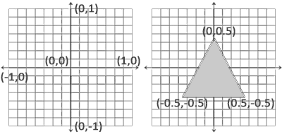
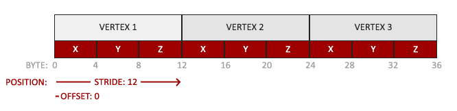

頂點數據(Vertex Data)是一系列頂點的集合。而頂點(Vertex)是一個 3D 坐標的數據的集合。
而頂點數據是用頂點屬性(Vertex Attribute)表示的，它可以包含任何我們想用的數據，比如3D位置和顏色值。

圖元(Primitive)：對我們傳入 GPU 的頂點(Vertex)數據指定，這些數據所表示的渲染類型。
我們是希望把這些數據渲染成一系列的點？一系列的三角形？還是僅僅是一個長長的線？
例如：GL_POINTS、GL_TRIANGLES、GL_LINE_STRIP。


* 頂點著色器(Vertex Shader)

將一個單獨的頂點作為輸入。頂點著色器主要的目的是把 3D 坐標轉為標準化設備坐標(Normalized Device Coordinates)，
同時頂點著色器允許我們對頂點屬性進行一些基本處理。

* 圖元/形狀 裝配(Primitive/Sahpe Assembly)

此階段將頂點著色器輸出的所有頂點作為輸入（如果是GL_POINTS，那麽就是一個頂點），並所有的點裝配成指定圖元的形狀；例如：三角形。

* 幾何著色器(Geometry Shader)

圖元裝配階段的輸出會傳遞給幾何著色器(Geometry Shader)。
幾何著色器把圖元形式的一系列頂點的集合作為輸入，它可以通過產生新頂點構造出新的（或是其它的）圖元來生成其他形狀。
例子中，它生成了另一個三角形。

* 光柵化階段(Rasterization Stage)

幾何著色器的輸出會被傳入光柵化階段(Rasterization Stage)，這里它會把圖元映射為最終屏幕上相應的像素，
生成供片段著色器(Fragment Shader)使用的片段(Fragment)。

在片段著色器運行之前會執行裁切(Clipping)。裁切會丟棄超出你的視圖以外的所有像素，用來提升執行效率。

`OpenGL 中的一個片段(Fragment)是 OpenGL 渲染一個像素所需的所有數據。`

* 片段著色器(Fragment Shader)

片段著色器的主要目的是計算一個像素的最終顏色，這也是所有 OpenGL 高級效果產生的地方。
通常，片段著色器包含 3D 場景的數據（比如光照、陰影、光的顏色等等），這些數據可以被用來計算最終像素的顏色。

* Alpha 測試和混合階段(Test and Blending)

在所有對應顏色值確定以後，最終的對象將會被傳到最後一個階段，我們叫做Alpha測試和混合(Blending)階段。

這個階段檢測片段的對應的深度和模板(Stencil)值，用它們來判斷這個像素是其它物體的前面還是後面，決定是否應該丟棄。

這個階段也會檢查alpha值（alpha 值定義了一個物體的透明度）並對物體進行混合(Blend)。
所以，即使在片段著色器中計算出來了一個像素輸出的顏色，在渲染多個三角形的時候最後的像素顏色也可能完全不同。

## 輸入

OpenGL不是簡單地把所有的3D坐標變換為屏幕上的2D像素；OpenGL僅當3D坐標在3個軸（x、y和z）上都為-1.0到1.0的範圍內時才處理它。

所有在所謂的標準化設備坐標(Normalized Device Coordinates)範圍內的坐標才會最終呈現在屏幕上（在這個範圍以外的坐標都不會顯示）。

若我們希望渲染一個三角形，我們一共要指定三個頂點，每個頂點都有一個3D位置。
我們會將它們以標準化設備坐標的形式（OpenGL 的可見區域）定義為一個 float 數組。

```cpp
float vertices[] = {
    -0.5f, -0.5f, 0.0f,
     0.5f, -0.5f, 0.0f,
     0.0f,  0.5f, 0.0f
};
```

通常深度可以理解為 z 坐標，它代表一個像素在空間中和你的距離，如果離你遠就可能被別的像素遮擋，你就看不到它了，它會被丟棄，以節省資源。
此例的 z 坐標皆為 0。

**標準化設備坐標(Normalized Device Coordinates, NDC)**

一旦你的頂點坐標已經在頂點著色器中處理過，它們就應該是標準化設備坐標了，標準化設備坐標是一個 x、y 和 z 值在 -1.0 到 1.0 的一小段空間。
任何落在範圍外的坐標都會被丟棄/裁剪，不會顯示在你的屏幕上。下面你會看到我們定義的在標準化設備坐標中的三角形(忽略z軸)：



與通常的屏幕坐標不同，y 軸正方向為向上，(0, 0) 坐標是這個圖像的中心，而不是左上角。
最終你希望所有(變換過的)坐標都在這個坐標空間中，否則它們就不可見了。

你的標準化設備坐標接著會變換為屏幕空間坐標(Screen-space Coordinates)，這是使用你通過 glViewport 函數提供的數據，
進行視口變換(Viewport Transform)完成的。所得的屏幕空間坐標又會被變換為片段輸入到片段著色器中。
---

定義這樣的頂點數據以後，我們會把它作為輸入發送給圖形渲染管線的第一個處理階段：頂點著色器。
通過頂點緩沖對象(Vertex Buffer Objects, VBO)管理，在 GPU 的記憶體中儲存大量頂點。

使用這些緩沖對象的好處是我們可以一次性的發送一大批數據到顯卡上，而不是每個頂點發送一次。
從 CPU 把數據發送到 GPU 相對較慢，所以只要可能我們都要嘗試盡量一次性發送盡可能多的數據。
當數據發送至 GPU 的記憶體中後，頂點著色器幾乎能立即訪問頂點，這是個非常快的過程。

就像 OpenGL 中的其它對象一樣，這個緩沖有一個獨一無二的 ID，所以我們可以使用 glGenBuffers 函數和一個緩沖 ID 生成一個 VBO 對象：

```cpp
unsigned int VBO;
glGenBuffers(1, &VBO);
```

OpenGL有很多緩沖對象類型，頂點緩沖對象的緩沖類型是 GL_ARRAY_BUFFER。OpenGL 允許我們同時綁定多個緩沖，只要它們是不同的緩沖類型。
我們可以使用 glBindBuffer 函數把新創建的緩沖綁定到 GL_ARRAY_BUFFER 目標上：

```cpp
glBindBuffer(GL_ARRAY_BUFFER, VBO);  
```

從這一刻起，我們使用的任何（在 GL_ARRAY_BUFFER 目標上的）緩沖調用都會用來配置 當前綁定的緩沖(VBO)。
然後我們可以調用 glBufferData 函數，它會把之前定義的頂點數據覆制到緩沖的記憶體中：

```cpp
// vertices: 定義頂點數據的數組
glBufferData(GL_ARRAY_BUFFER, sizeof(vertices), vertices, GL_STATIC_DRAW);
```

glBufferData 是一個專門用來把用戶定義的數據覆制到當前綁定緩沖的函數。

它的第一個參數是目標緩沖的類型：頂點緩沖對象當前綁定到 GL_ARRAY_BUFFER 目標上。

第二個參數指定傳輸數據的大小(以字節為單位)；用一個簡單的 sizeof 計算出頂點數據大小就行。

第三個參數是我們希望發送的實際數據。

第四個參數指定了我們希望顯卡如何管理給定的數據。它有三種形式：

* GL_STATIC_DRAW ：數據不會或幾乎不會改變。
* GL_DYNAMIC_DRAW：數據會被改變很多。
* GL_STREAM_DRAW ：數據每次繪制時都會改變。

三角形的位置數據不會改變，每次渲染調用時都保持原樣，所以它的使用類型最好是 GL_STATIC_DRAW。
如果，比如說一個緩沖中的數據將頻繁被改變，那麽使用的類型就是 GL_DYNAMIC_DRAW 或 GL_STREAM_DRAW，
這樣就能確保 GPU 把數據放在能夠高速寫入的記憶體部分。

現在我們已經把頂點數據儲存在 GPU 的記憶體中，用 VBO 這個頂點緩沖對象管理。

## 頂點著色器(Vertex Shader)

頂點著色器是幾個可自行編碼的著色器中的一個。如果我們打算做渲染的話，現代 OpenGL 需要我們至少設置一個頂點和一個片段著色器。

我們需要做的第一件事是用著色器語言 GLSL(OpenGL Shading Language)編寫頂點著色器，然後編譯這個著色器，這樣我們就可以在程式中使用它了。

每個著色器都起始於一個版本聲明。OpenGL 3.3 以及和更高版本中，GLSL 版本號和 OpenGL 的版本是匹配的（比如說 GLSL 420 版本對應於 OpenGL 4.2）。
下面你會看到一個非常基礎的 GLSL 頂點著色器的源代碼：

```GLSL
#version 330 core
layout (location = 0) in vec3 pos;

void main()
{
    gl_Position = vec4(pos.x, pos.y, pos.z, 1.0);
}
```

`#version 330 core` 表示我們會使用核心模式，GLSL 版本號為 330(因為我們使用 OpenGL 3.3 )

下一步，使用 in 關鍵字，在頂點著色器中聲明所有的輸入頂點屬性(Input Vertex Attribute)。
現在我們只關心位置(Position)數據，所以我們只需要一個頂點屬性。

GLSL 有一個向量數據類型，它包含 1 到 4 個 float 分量，包含的數量可以從它的後綴數字看出來。
由於每個頂點都有一個 3D 坐標，我們就創建一個 vec3 輸入變量 pos。

通過 layout (location = 0) 設定了輸入變量的位置值(Location)，之後在傳入實際數據時會需要這個位置值告訴 GLSL 
現在傳入的數據對應到哪個變數。

為了設置頂點著色器的輸出，我們必須把位置數據賦值給預定義的 gl_Position 變量，它在幕後是 vec4 類型的。
gl_Position 為 GLSL 自身定義的頂點著色器輸出，以齊次座標的形式存在。

在 main 函數的最後，我們將 gl_Position 設置的值會成為該頂點著色器的輸出。
由於我們的輸入是一個 3 分量的向量，我們必須把它轉換為 4 分量的。
我們可以把 vec3 的數據作為 vec4 構造器的參數，同時把 w 分量設置為1.0f。

當前這個頂點著色器可能是我們能想到的最簡單的頂點著色器了，因為我們對輸入數據什麽都沒有處理就把它傳到著色器的輸出了。
在真實的程序里輸入數據通常都不是標準化設備坐標，所以我們首先必須先把它們轉換至 OpenGL 的可視區域內。

## 編譯著色器

為了讓 OpenGL 能夠使用頂點著色器，我們必須在運行時動態編譯它的原始碼。首先創建一個著色器對象，注意還是用 ID 來引用的。
所以我們儲存這個頂點著色器為 unsigned int，然後用 glCreateShader 創建這個著色器：

```cpp
unsigned int vertex_shader;

// 建立 Shader 物件，並返回 ID
vertex_shader = glCreateShader(GL_VERTEX_SHADER);
```

我們把需要創建的著色器類型以參數形式提供給 glCreateShader。由於我們正在創建一個頂點著色器，傳遞的參數是 GL_VERTEX_SHADER。

下一步我們把這個著色器源碼附加到著色器對象上，然後編譯它：

```cpp
// 將 vertex_shader_source: 頂點著色器 原始碼字串 附加到 vertex_shader
glShaderSource(vertex_shader, 1, &vertex_shader_source, NULL);

// 執行編譯
glCompileShader(vertex_shader);
```

glShaderSource 函數把要編譯的著色器對象作為第一個參數。第二參數指定了傳遞的源碼字符串數量，這里只有一個。
第三個參數是頂點著色器的原始碼，第四個參數我們先設置為 NULL。

你可能會希望檢測在調用 glCompileShader 後編譯是否成功了，如果沒成功的話，你還會希望知道錯誤是什麽，這樣你才能修覆它們。

首先我們定義一個整型變量來表示是否成功編譯，還定義了一個儲存錯誤消息（如果有的話）的容器。
然後我們用 glGetShaderiv 檢查是否編譯成功。如果編譯失敗，我們會用 glGetShaderInfoLog 獲取錯誤消息，然後打印它。

檢測編譯時錯誤可以通過以下代碼來實現：

```cpp
int  success;
char info_log[512];

// 檢查是否編譯成功
glGetShaderiv(vertex_shader, GL_COMPILE_STATUS, &success);

if(!success)
{
    // 獲取錯誤消息
    glGetShaderInfoLog(vertex_shader, 512, NULL, info_log);
    std::cout << "ERROR::SHADER::VERTEX::COMPILATION_FAILED\n" << info_log << std::endl;
}
```

如果編譯的時候沒有檢測到任何錯誤，頂點著色器就被編譯成功了。

## 片段著色器(Fragment Shader)

片段著色器是第二個也是最後一個我們打算創建的用於渲染三角形的著色器。片段著色器所做的是計算像素最後的顏色輸出。
為了讓事情更簡單，我們的片段著色器將會一直輸出橘黃色。

在計算機圖形中顏色被表示為有4個元素的數組：紅色、綠色、藍色和 alpha(透明度)分量，通常縮寫為 RGBA。
當在 OpenGL 或 GLSL 中定義一個顏色的時候，我們把顏色每個分量的強度設置在 0.0 到 1.0 之間。

同樣，利用 `#version 330 core` 表示我們會使用核心模式，GLSL 版本號為 330(因為我們使用 OpenGL 3.3 )。

由於片段著色器沒有預設的輸出變數，我們可以用 out 關鍵字聲明輸出變量，這里我們命名為 frag_color。
片段著色器只需要一個輸出變量，這個變量是一個 4 分量向量，它表示的是最終的輸出顏色，我們應該自己將其計算出來。

```GLSL
#version 330 core
out vec4 frag_color;

void main()
{
    frag_color = vec4(1.0f, 0.5f, 0.2f, 1.0f);
} 
```

編譯片段著色器的過程與頂點著色器類似，只不過我們使用 GL_FRAGMENT_SHADER 常量作為著色器類型：

```cpp
unsigned int fragment_shader;

// 建立 Shader 物件，並返回 ID
fragment_shader = glCreateShader(GL_FRAGMENT_SHADER);

// 將 fragment_shader_source: 片段著色器 原始碼字串 附加到 fragment_shader
glShaderSource(fragment_shader, 1, &fragment_shader_source, NULL);

// 執行編譯
glCompileShader(fragment_shader);
```

兩個著色器現在都編譯了，剩下的事情是把兩個著色器對象鏈接到一個用來渲染的著色器程式(Shader Program)中。

## 著色器程式物件(Shader Program Object)

著色器程式物件是多個著色器合並之後並最終鏈接完成的版本。
如果要使用剛才編譯的著色器我們必須把它們鏈接(Link)為一個著色器程序對象，然後在渲染對象的時候激活這個著色器程序。
已激活著色器程序的著色器將在我們發送渲染調用的時候被使用。

當鏈接著色器至一個程序的時候，它會把每個著色器的輸出鏈接到下個著色器的輸入。當輸出和輸入不匹配的時候，你會得到一個連接錯誤。

創建一個程序對象很簡單：

```cpp
unsigned int shader_program;

// 建立 Program 物件，並返回 ID
shader_program = glCreateProgram();

// 將著色器附加到 shader_program 當中
glAttachShader(shader_program, vertex_shader);
glAttachShader(shader_program, fragment_shader);

// 鏈結剛才附加的著色器到 shader_program
glLinkProgram(shader_program);
```

在把著色器對象鏈接到Program 物件以後，記得刪除著色器對象，我們不再需要它們了：

```cpp
glDeleteShader(vertexShader);
glDeleteShader(fragmentShader);
```

就像著色器的編譯一樣，我們也可以檢測鏈接著色器程序是否失敗，並獲取相應的日誌。
與上面不同，我們不會調用 glGetShaderiv 和 glGetShaderInfoLog，現在我們使用：

```cpp
// 檢查是否編譯成功 Shader → Program
glGetProgramiv(shader_program, GL_LINK_STATUS, &success);

if(!success) {
    // 獲取錯誤消息
    glGetProgramInfoLog(shader_program, 512, NULL, info_log);
    ...
}
```

得到的結果就是一個"已附加著色器並完成鏈結的 Program 物件"，我們可以調用 glUseProgram 函數，以激活這個程序對象：

```cpp
glUseProgram(shader_program);
```

在 glUseProgram 函數調用之後，每個著色器調用和渲染調用都會使用這個程序對象（也就是之前寫的著色器)了。

現在，我們已經把輸入頂點數據發送給了 GPU，並指示了 GPU 如何在頂點和片段著色器中處理它。
但 OpenGL 還不知道它該如何解釋記憶體中的頂點數據，以及它該如何將頂點數據鏈接到頂點著色器的屬性上。我們需要告訴 OpenGL 怎麽做。

## 鏈接頂點著色器屬性

頂點著色器允許我們指定任何以頂點屬性為形式的輸入。
這使其具有很強的靈活性的同時，它還的確意味著我們必須手動指定輸入數據的哪一個部分對應頂點著色器的哪一個頂點屬性。
所以，我們必須在渲染前指定 OpenGL 該如何解釋頂點數據。

我們的頂點緩沖數據會被解析為下面這樣子：



* float 被儲存為 32 bit（4 bytes, 1 bytes = 8 bit）浮點值。
* 每個位置包含 3 個這樣的值(x, y, z)。
* 在這 3 個值之間沒有空隙（或其他值）。這幾個值在數組中緊密排列(Tightly Packed)。
* 數據中第一個值在緩沖開始的位置。

有了這些資訊我們就可以使用 glVertexAttribPointer 函數告訴 OpenGL 該如何解析頂點數據（應用到逐個頂點屬性上）了：

```cpp
/*
void glVertexAttribPointer(
    GLuint          index,
    GLint           size,
    GLenum          type,
    GLboolean       normalized,
    GLsizei         stride,
    const GLvoid*   pointer
);

index:
我們在頂點著色器中使用 layout(location = 0) 定義了 position 頂點屬性的位置值(Location)，它將頂點屬性的位置值設置為 0。
因為我們希望把數據傳遞到這一個頂點的位置屬性中，所以這里我們傳入 0。

size:
指定頂點屬性的大小。頂點屬性是一個 vec3，它由 3 個值組成，所以大小是 3。

type:
指定數據的類型，這里是 GL_FLOAT(GLSL 中 vec* 都是由浮點數值組成的)。

normalized:
定義我們是否希望數據被標準化(Normalize)。如果我們設置為 GL_TRUE，所有數據都會被映射到 0（對於有符號型 signed 數據是 -1）到 1 之間。
我們把它設置為 GL_FALSE。

stride:
步長(Stride)，它告訴我們在連續的頂點屬性組之間的間隔，即前一個 vertex shader 到下一個 vertex shader 間隔多少 bit。

float 為 4 bit，而位置的變數型態為 vec3，且中間沒有其他 attribute，因此 stride 為 3(個數值) * 4(bit)。

要注意的是由於我們知道這個數組是緊密排列的（在兩個頂點屬性之間沒有空隙）我們也可以設置為 0 來讓 OpenGL 決定具體步長是多少
（只有當數值是緊密排列時才可用）。
一旦我們有更多的頂點屬性，我們就必須更小心地定義每個頂點屬性之間的間隔。
    
這個參數的意思簡單說就是從這個屬性第二次出現的地方到整個數組 0 位置之間有多少字節。

pointer:
與 buffer 第一個位置的偏移量，若有其他 attribute 在 position 之後，則其 pointer 會是 12(position 的大小，3*4=12)
它表示位置數據在緩沖中起始位置的偏移量(Offset)。由於位置數據在數組的開頭，所以這里是 0。
*/
glVertexAttribPointer(0, 3, GL_FLOAT, GL_FALSE, 3 * sizeof(float), (void*)0);
glEnableVertexAttribArray(0);
```

每個頂點屬性從一個 VBO 管理的記憶體中獲得它的數據，而具體是從哪個 VBO（程序中可以有多個 VBO）獲取則是通過在調用 
glVertexAttribPointer 時綁定到 GL_ARRAY_BUFFER 的 VBO 決定的。

由於在調用 glVertexAttribPointer 之前綁定的是先前定義的 VBO 對象，頂點屬性 0 現在會鏈接到它的頂點數據。

現在我們已經定義了 OpenGL 該如何解釋頂點數據，我們現在應該使用 glEnableVertexAttribArray，以頂點屬性位置值作為參數，啟用頂點屬性；
頂點屬性默認是禁用的。

自此，我們使用一個頂點緩沖對象將頂點數據初始化至緩沖中，建立了一個頂點和一個片段著色器，
並告訴了 OpenGL 如何把頂點數據鏈接到頂點著色器的頂點屬性上。在 OpenGL 中繪制一個物體，代碼會像是這樣：

```cpp
// 0. 覆制頂點數組到緩沖中供 OpenGL 使用
// glBindBuffer 後，之後對 GL_ARRAY_BUFFER 類型緩衝的操作都會使用到的 VBO 就是現在參數裡的 VBO
glBindBuffer(GL_ARRAY_BUFFER, VBO);

glBufferData(GL_ARRAY_BUFFER, sizeof(vertices), vertices, GL_STATIC_DRAW);

// 1. 設置頂點屬性指針
glVertexAttribPointer(0, 3, GL_FLOAT, GL_FALSE, 3 * sizeof(float), (void*)0);
glEnableVertexAttribArray(0);

// 2. 當我們渲染一個物體時要使用著色器程序
glUseProgram(shaderProgram);

// 3. 繪制物體
someOpenGLFunctionThatDrawsOurTriangle();
```

每當我們繪制一個物體的時候都必須重覆這一過程。這看起來可能不多，但是如果有超過5個頂點屬性，上百個不同物體呢（這其實並不罕見）。
綁定正確的緩沖對象，為每個物體配置所有頂點屬性很快就變成一件麻煩事。

頂點數組物件(Vertex Array Object, VAO)可以使我們把所有這些狀態配置儲存在一個對象中，並且可以通過綁定這個對象來恢覆狀態。

## 頂點數組物件(Vertex Array Object, VAO)

頂點數組物件可以像頂點緩沖對象那樣被綁定，任何隨後的頂點屬性調用都會儲存在這個 VAO 中。

這樣的好處就是，當配置頂點屬性指針時，你只需要將那些調用執行一次，之後再繪制物體的時候只需要綁定相應的 VAO 就行了。
這使在不同頂點數據和屬性配置之間切換變得非常簡單，只需要綁定不同的 VAO 就行了。

一個 VAO 會儲存以下這些內容：

* glEnableVertexAttribArray 和 glDisableVertexAttribArray 的調用。
* 通過 glVertexAttribPointer 設置的頂點屬性配置。
* 通過 glVertexAttribPointer 調用與頂點屬性關聯的頂點緩沖物件 VBO。


剛剛設置的所有狀態都將存儲在 VAO 中，OpenGL 的核心模式要求我們使用 VAO，所以它知道該如何處理我們的頂點輸入。
如果我們綁定 VAO 失敗，OpenGL 會拒絕繪制任何東西。

創建一個VAO和創建一個VBO很類似：

```cpp
unsigned int VAO;

// 建立 VertexArrays 物件
glGenVertexArrays(1, &VAO);
```

要想使用 VAO，要做的只是使用 glBindVertexArray 綁定 VAO。
從綁定之後起，我們應該綁定和配置對應的VBO和屬性指針，之後解綁VAO供之後使用。
當我們打算繪制一個物體的時候，我們只要在繪制物體前簡單地把 VAO 綁定到希望使用的設定上就行了。

這段代碼應該看起來像這樣：

```cpp
// ..:: 初始化代碼（只運行一次 (除非你的物體頻繁改變)） :: ..

// 1. 綁定 VAO
glBindVertexArray(VAO);

// 2. 把頂點數組覆制到緩沖中供OpenGL使用
glBindBuffer(GL_ARRAY_BUFFER, VBO);
glBufferData(GL_ARRAY_BUFFER, sizeof(vertices), vertices, GL_STATIC_DRAW);

// 3. 設置頂點屬性指針
glVertexAttribPointer(0, 3, GL_FLOAT, GL_FALSE, 3 * sizeof(float), (void*)0);
glEnableVertexAttribArray(0);

[...]

// ..:: 繪制代碼（渲染循環中） :: ..

// 4. 繪制物體
glUseProgram(shaderProgram);
glBindVertexArray(VAO);
someOpenGLFunctionThatDrawsOurTriangle();
```

一般當你打算繪制多個物體時，你首先要生成/配置所有的 VAO（和必須的 VBO 及屬性指針)，然後儲存它們供後面使用。
當我們打算繪制物體的時候就拿出相應的 VAO，綁定它，繪制完物體後，再解綁 VAO。

## 繪製

要想繪制我們想要的物體，OpenGL 給我們提供了 glDrawArrays 函數，
它使用當前激活的著色器，之前定義的頂點屬性配置，和 VBO 的頂點數據（通過 VAO 間接綁定）來繪制圖元。

```cpp
// 使用 "已附加著色器並完成鏈結的 Program 物件"
glUseProgram(shader_program);

// 綁定 VAO
glBindVertexArray(VAO);

// 繪製(圖元選用 GL_TRIANGLES)
// 第二個參數指定了頂點數組的起始索引，我們這里填 0。
// 最後一個參數指定我們打算繪制多少個頂點，這里是 3（我們只從我們的數據中渲染一個三角形，它只有3個頂點）。
glDrawArrays(GL_TRIANGLES, 0, 3);
```

## 索引緩沖物件(Element Buffer Object，EBO，也叫 Index Buffer Object，IBO)

在渲染頂點這一話題上我們還有最後一個需要討論的東西——索引緩沖物件(EBO)。
要解釋索引緩沖對象的工作方式最好還是舉個例子：假設我們不再繪制一個三角形而是繪制一個矩形。
我們可以繪制兩個三角形來組成一個矩形（OpenGL 主要處理三角形）。
這會生成下面的頂點的集合：

```cpp
float vertices[] = {
    // 第一個三角形
     0.5f,  0.5f, 0.0f,  // 右上角
     0.5f, -0.5f, 0.0f,  // 右下角
    -0.5f,  0.5f, 0.0f,  // 左上角

    // 第二個三角形
     0.5f, -0.5f, 0.0f,  // 右下角
    -0.5f, -0.5f, 0.0f,  // 左下角
    -0.5f,  0.5f, 0.0f   // 左上角
};
```

可以看到，有幾個頂點重複了。我們指定了右下角和左上角兩次！一個矩形只有 4 個而不是 6 個頂點，這樣就產生 50% 的額外開銷。

當我們有包括上千個三角形的模型之後這個問題會更糟糕，這會產生一大堆浪費。更好的解決方案是只儲存不同的頂點，並設定繪制這些頂點的順序。
這樣子我們只要儲存 4 個頂點就能繪制矩形了，之後只要指定繪制的順序就行了。

索引緩沖物件的工作方式和頂點緩沖物件一樣，EBO 也是一個緩沖，它(EBO)專門儲存索引，OpenGL 調用這些頂點的索引來決定該繪制哪個頂點。
所謂的索引繪制(Indexed Drawing)正是我們問題的解決方案。首先，我們先要定義（不重覆的）頂點，和繪制出矩形所需的索引：

```cpp
float vertices[] = {
     0.5f,  0.5f, 0.0f,  // 右上角 0
     0.5f, -0.5f, 0.0f,  // 右下角 1
    -0.5f, -0.5f, 0.0f,  // 左下角 2
    -0.5f,  0.5f, 0.0f   // 左上角 3
};

// 注意索引從 0 開始! 
unsigned int indices[] = { 
    0, 1, 3, // 第一個三角形
    1, 2, 3  // 第二個三角形
};
```

可以看到，當時用索引的時候，我們只定義了 4 個頂點，而不是 6 個。下一步我們需要創建索引緩沖物件：

```cpp
unsigned int EBO;
glGenBuffers(1, &EBO);
```

與 VBO 類似，我們先綁定 EBO 然後用 glBufferData 把索引覆制到緩沖里。
同樣，和 VBO 類似，我們會把這些函數調用放在綁定和解綁函數調用之間，只不過這次我們把緩沖的類型定義為 GL_ELEMENT_ARRAY_BUFFER。

```cpp
glBindBuffer(GL_ELEMENT_ARRAY_BUFFER, EBO);
glBufferData(GL_ELEMENT_ARRAY_BUFFER, sizeof(indices), indices, GL_STATIC_DRAW);
```

要注意的是，我們傳遞了 GL_ELEMENT_ARRAY_BUFFER 當作緩沖目標。

最後一件要做的事是用 glDrawElements 來替換 glDrawArrays 函數，來指明我們從索引緩沖渲染。
使用 glDrawElements 時，我們會使用當前綁定的索引緩沖對象中的索引進行繪制：

```cpp
glBindBuffer(GL_ELEMENT_ARRAY_BUFFER, EBO);

/* 繪製
void glDrawElements(	
    GLenum          mode,
 	GLsizei         count,
 	GLenum          type,
 	const GLvoid *  indices);

mode:   指定要渲染時的圖元種類(繪制的模式)。Specifies what kind of primitives to render. 
        包含 GL_POINTS, GL_LINE_STRIP, GL_LINE_LOOP, GL_LINES, GL_LINE_STRIP_ADJACENCY, GL_LINES_ADJACENCY, 
        GL_TRIANGLE_STRIP, GL_TRIANGLE_FAN, GL_TRIANGLES, GL_TRIANGLE_STRIP_ADJACENCY and GL_TRIANGLES_ADJACENCY.
 
count:  要渲染的元素數量(頂點的個數)，這里填 6，因為一共需要繪制 6 個頂點。Specifies the number of elements to be rendered. 

type:   索引的類型。Specifies the type of the values in indices. 
        必須是 GL_UNSIGNED_BYTE, GL_UNSIGNED_SHORT, 或 GL_UNSIGNED_INT 其中之一。 

indices: 指定當前綁定到GL_ELEMENT_ARRAY_BUFFER目標的緩衝區數據存儲區中數組中第一個索引的偏移量。
        Specifies an offset of the first index in the array in the data store of the buffer currently bound 
        to the GL_ELEMENT_ARRAY_BUFFER target. 
*/
glDrawElements(GL_TRIANGLES, 6, GL_UNSIGNED_INT, 0);
```

glDrawElements 函數從當前綁定到 GL_ELEMENT_ARRAY_BUFFER 目標的 EBO 中獲取索引。
這意味著我們必須在每次要用索引渲染一個物體時綁定相應的EBO，這還是有點麻煩。

不過頂點數組物件(VAO)同樣可以保存索引緩沖對象(EBO)的綁定狀態。
VAO 綁定時正在綁定的索引緩沖對象會被保存為 VAO 的元素緩沖對象。綁定 VAO 的同時也會自動綁定 EBO。

當目標是 GL_ELEMENT_ARRAY_BUFFER 的時候，VAO 會儲存 glBindBuffer 的函數調用。

這也意味著它也會儲存解綁調用，所以確保你沒有在解綁 VAO 之前解綁索引數組緩沖，否則它就沒有這個 EBO 配置了。


最後的初始化和繪制代碼現在看起來像這樣：

```cpp
最後的初始化和繪制代碼現在看起來像這樣：

// ..:: 初始化代碼 :: ..

// 1. 綁定頂點數組對象
glBindVertexArray(VAO);

// 2. 把我們的頂點數組覆制到一個頂點緩沖中，供OpenGL使用
glBindBuffer(GL_ARRAY_BUFFER, VBO);
glBufferData(GL_ARRAY_BUFFER, sizeof(vertices), vertices, GL_STATIC_DRAW);

// 3. 覆制我們的索引數組到一個索引緩沖中，供OpenGL使用
glBindBuffer(GL_ELEMENT_ARRAY_BUFFER, EBO);
glBufferData(GL_ELEMENT_ARRAY_BUFFER, sizeof(indices), indices, GL_STATIC_DRAW);

// 4. 設定頂點屬性指針
glVertexAttribPointer(0, 3, GL_FLOAT, GL_FALSE, 3 * sizeof(float), (void*)0);
glEnableVertexAttribArray(0);

[...]

// ..:: 繪制代碼（渲染循環中） :: ..

glUseProgram(shader_program);
glBindVertexArray(VAO);
glDrawElements(GL_TRIANGLES, 6, GL_UNSIGNED_INT, 0)
glBindVertexArray(0);
```
